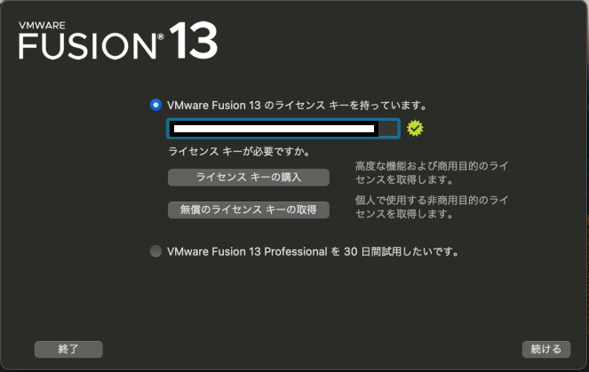

# ARM CPU Minikube Setup

These are the steps to start minikube bare in an armCPU environment such as apple silicon.

## Procedure

1. Download ubuntu image for arm.

    [Ubuntu Server for ARM](https://ubuntu.com/downloald/server/arm)

1. VWware Fusion Player

    1. Follow the instructions to create a VMware Customer Connect account to obtain a personal use license for VWware Fusion Player.

        ["VMware Customer Connect" Register](https://customerconnect.vmware.com/jp/account-registration)

    1. Download
        [Try VMware Fusion Pro for Intel or Apple Silicon Macs](https://www.vmware.com/products/fusion/fusion-evaluation.html)

        

    1. Installation and activation
        1. Double-click the downloaded `.dmg` file to proceed with the installation.
            
            
        1. ライセンス認証画面での進み方
            
            
            
            
            
            
            
        1. アクセシビリティを許可する
            

    1. Starting a virtual machine
        1. Drag and drop the `.iso` file onto the new screen of VMware Fusion Player
            
        1. 続ける押下
            
        1. スペックはデフォルトでよい終了
            
